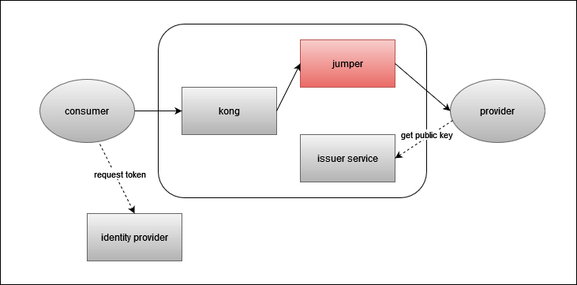
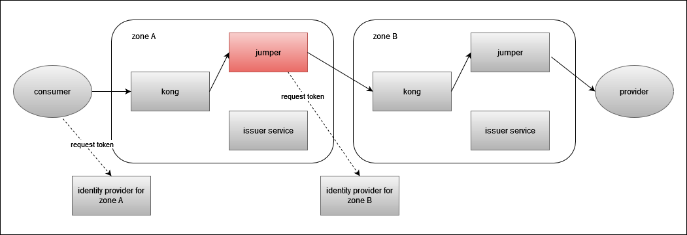
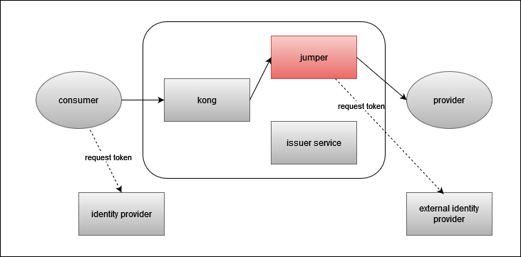
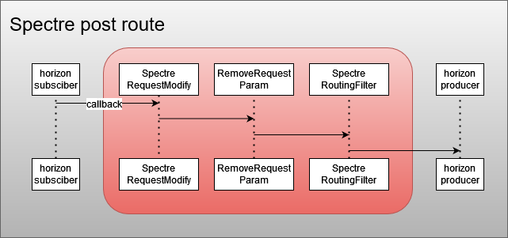
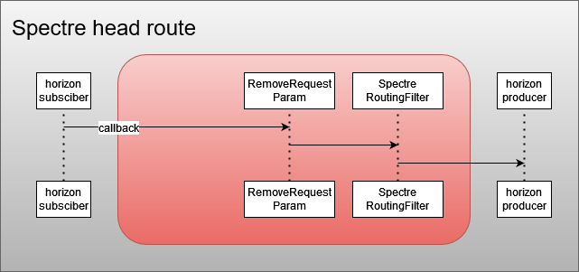

<!--
SPDX-FileCopyrightText: 2023 Deutsche Telekom AG

SPDX-License-Identifier: CC0-1.0    
-->

# Jumper

## About

Jumper is a cloud-native scalable API Gateway expected to run as a sidecar of Kong API Gateway.
Is based on [Spring Cloud Gateway](https://spring.io/projects/spring-cloud-gateway).
Its purpose is mainly advanced token (OAuth 2.0) handling, enables support for:
* mesh functionality
* external authorization
* own Gateway tokens
* customizing headers
* listening on given service (creates events for issued traffic) 

On incoming side is called by Kong. On outgoing side is the last component, which calls provider.
For its functionality relies on information provided by Kong component using headers, itself is stateless.  

## Code of Conduct

This project has adopted the [Contributor Covenant](https://www.contributor-covenant.org/) in version 2.1 as our code of conduct. Please see the details in our [CODE_OF_CONDUCT.md](CODE_OF_CONDUCT.md). All contributors must abide by the code of conduct.

By participating in this project, you agree to abide by its [Code of Conduct](./CODE_OF_CONDUCT.md) at all times.

## Licensing

This project follows the [REUSE standard for software licensing](https://reuse.software/).
Each file contains copyright and license information, and license texts can be found in the [./LICENSES](./LICENSES) folder. For more information visit https://reuse.software/.

## Scenarios
Scenarios from various aspects of Jumper functionality perspective. <b>Scenarios from different perspective can be overlapping!</b>

### Scenarios from outgoing token perspective

#### One token
Most common scenario, request is forwarded to provider, while jumper combines information from incoming token and headers, creates and signs new oauth token.

Headers expected on incoming side:
* remote_api_url - url, to which is request forwarded
* api_base_path - base path of Kong service from the same Gateway initially called, passed as requestPath claim
* realm - for setting correct issuer
* environment - passed as env claim
* access_token_forwarding - false, used to determine scenario

Structure of the created token (aka One token):  
``
{
  "kid": "<matching certificate available on Issuer service>",
  "typ": "JWT",
  "alg": "RS256"
}
``  
``
{
  "sub": "<taken from incoming token>",
  "clientId": "<taken from incoming token>",   
  "azp": "stargate",
  "originZone": "<taken from incoming token>",
  "typ": "Bearer",
  "env": "<taken from header>",
  "operation": "<performed operation>",
  "requestPath": "<taken from header>",
  "originStargate": "<taken from incoming token>",
  "iss": "<composed value with issuer address for created token>",
  "exp": <taken from incoming token>,
  "iat": <taken from incoming token>
}
``

Relevant headers on outgoing side:
* Authorization - One token

#### Last Mile security token
Legacy scenario, request is forwarded to provider with 2 tokens, original incoming and merged one (as an <i>X-Gateway-Token</i> header).  

Headers expected on incoming side:
* remote_api_url - url, to which is request forwarded
* api_base_path - base path of Kong service from the same Gateway initially called, passed as requestPath claim
* realm - for setting correct issuer
* environment - passed as env claim
* access_token_forwarding - true, used to determine scenario

Structure of the created token (aka LMS token)
``
{
  "kid": "<matching certificate available on Issuer service>",
  "typ": "JWT",
  "alg": "RS256"
}
``  
``
{
  "sub": "<taken from incoming token>",
  "clientId": "<taken from incoming token>",
  "azp": "stargate",
  "originZone": "aws",
  "accessTokenSignature": "<signature of incoming token>",
  "typ": "Bearer",
  "operation": "<performed operation>",
  "requestPath": "<taken from header>",
  "originStargate": "<taken from incoming token>",
  "iss": "<composed value with issuer address for created token>",
  "exp": <taken from incoming token>,
  "iat": <taken from incoming token>
}
``

Relevant headers on outgoing side:
* Authorization - original incoming token
* X-Gateway-Token - LMS token

#### Mesh token
Scenario with multiple Gateway instances involved. Jumper fetches oauth token from other zone identity provider (aka mesh token), 
while original authorization token is passed as a <i>consumer-token</i> header. Mesh token is cached, so fetching is performed only if valid token is not available.

  

Headers expected on incoming side:
* remote_api_url - url (including service base path) of other zone Gateway, to which is request forwarded
* issuer - issuer of other zone identity provider
* client_id - client id with dedicated client on other zone identity provider
* client_secret - client secret with dedicated client on other zone identity provider

Relevant headers on outgoing side:
* Authorization - mesh token
* consumer-token - original incoming token

#### External authorization token
Request is forwarded to provider with authorization token fetched from identity provider defined by provider itself.
Available only for Spacegate.

Headers expected on incoming side:
* remote_api_url - url, to which is request forwarded
* token_endpoint - external identity provider to fetch token from  
if credentials are defined on provider level
* client_id - client id of external identity provider to fetch token from
* client_secret  - client secret of external identity provider to fetch token from
if credentials differs per consumer
* jumper_config with following content:  
``
{
  "oauth": {
  "<consumer matching the one from incoming token>": {
  "clientId": "<client id to query token from externail idp>",
  "clientSecret": "<client secret to query token from externail idp>"
  }
  }
}
``

#### Basic auth token
To support legacy systems also Basic Authorization can be passed to provider. Authorization can be defined globally for provider,
or per consumer basis. Available only for Spacegate.  

Headers expected on incoming side:
* remote_api_url - url, to which is request forwarded
* jumper_config with following content:  
``
{
  "basicAuth": {
  "default/<consumer name>": {
  "username": "<username>",
  "password": "<password>"
  }
  }
}
``
### Scenarios from used route perspective
#### Proxy route
Default route to be used for processing majority off traffic. All scenarios described within "token perspective" are supported.
Following filters with respective order are involved:

* RequestFilter - most of the logic, like token, header handling, routing here
* RemoveRequestHeaderFilter - defined header list is removed, mainly headers passing information from Kong to Jumper
* ResponseFilter - minor tracing adjustment

#### Listener route
In addition to proxy route functionality also enables interface listening support aka Spectre.  
Following filters with respective order are involved:

* RequestFilter - most of the logic, like token, header handling, routing here
* RemoveRequestHeaderFilter - defined header list is removed, mainly headers passing information from Kong to Jumper
* ResponseFilter - minor tracing adjustment
* RequestTransformationFilter - store request body for future use
* SpectreRequestFilter - decision for creating Spectre request event for given consumer/API combination
* ResponseTransformationFilter - store response body for future use
* SpectreResponseFilter - decision for creating Spectre response event for given consumer/API combination

#### auto_event_route_post
Route used only for Spectre. On incoming side receive callback. Generic event type is modified to listener specific
and forwarded to Horizon for further processing.  
Following filters with respective order are involved:  

* SpectreRoutingFilter - set authorization token and adapt routing path to Horizon
* removeRequestParameter - remove no longer needed parameter
* SpectreRequestModify - adapt event content from generic, to listener specific

#### auto_event_route_head
Route used only for Spectre. Callback consumer has to support HEAD request for possible healthcheck.  
Following filters with respective order are involved:  

* SpectreRoutingFilter - set authorization token and adapt routing path to Horizon
* removeRequestParameter - remove no longer needed parameter

### Spectre
Spectre enables a third party, the so-called listener application, to listen to the payload of a communication between consumer and provider for a specific API.
Prerequisite is to have correctly configured <i>horizon.publishEventUrl</i>  
Mandatory headers on incoming side:
* jumper_config with following content:  
``
{
  "routeListener": {
  "<consumer matching the one from incoming token>": {
  "issue": "<value passed to created event, means API>",
  "serviceOwner": "<value passed to created event, means service name>"
  }
  }
}
``

Request/Response events are created, if consumer/API combination matches.  Created event structure:  
``
{
"time" : "<timestamp>",
"id" : "<event id>",
"type" : "<particular listener event type>",
"source" : "<source name>",
"specversion" : "1.0",
"datacontenttype" : "application/json",
"data" : {
"consumer" : "<consumer, value from incoming token>",
"provider" : "service name, value from jumper config",
"issue" : "<API, value from jumper config>",
"kind" : "REQUEST/RESPONSE",
"method" : "<method>",
"header" : {
<headers of processed request>
},
"payload" : <procesed request body>
}
}
``

### Header enhancement/manipulation
* X-Spacegate-Token - if any Spacegate is involved, incoming token is copied to <i>X-Spacegate-Token</i> header
* X-Forwarded-Host/Port/Proto - to avoid additional reporting Kong + Jumper as separate hop, these headers needs to be adapted
* X-Origin-Stargate - shows, which Gateway host was originally called (mesh concept)
* X-Origin-Zone - shows, which Gateway zone was originally called (mesh concept)

### Tracing support
* [b3 zipkin propagation](https://github.com/openzipkin/b3-propagation) supported. Prerequisite is to set valid <i>spring.zipkin.baseUrl</i>

### Miscellaneous
* scopes - if scopes claim present within incoming token, information is passed to OneToken, which allows fine-grained/resource level authorization 
* x-pubsub-publisher-id - Horizon callback integration, publisher id header is passed to OneToken
* x-pubsub-subscriber-id - Horizon callback integration, subscriber id header is passed to OneToken

### Glossary
* <b>Gateway</b> - set of Kong + Jumper + Issuer service
* <b>Spacegate</b> - Gateway accessible from/having access to (after firewall clearance) Internet
* <b>jumper_config</b> - base64 encoded structure used to pass various information

