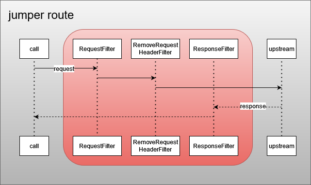
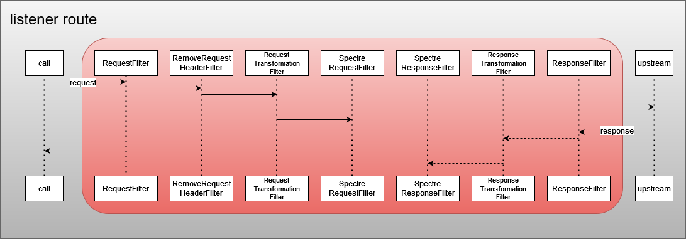

<!--
SPDX-FileCopyrightText: 2023 Deutsche Telekom AG

SPDX-License-Identifier: CC0-1.0    
-->

# Jumper

[](LICENSE)

## About

Jumper is a cloud-native scalable API Gateway expected to run as a sidecar of Kong API Gateway.
It is based on [Spring Cloud Gateway](https://spring.io/projects/spring-cloud-gateway).

Its purpose is mainly advanced token (OAuth 2.0) handling, enabling support for:
* Mesh functionality
* External authorization
* Gateway token generation
* Header customization
* Service event listening (creates events for issued traffic) 

On the incoming side, it is called by Kong. On the outgoing side, it is the last component that calls the provider.
For its functionality, it relies on information provided by the Kong component using headers, while remaining stateless itself.


## Getting Started

The easiest way to get started is to build your own Jumper image using the [one-step multi-stage Dockerfile](#one-step-multi-stage-build).

Once you have that, refer to the [Configuration](#configuration) section to find out how to use Jumper locally or deploy it using the [Stargate Helm Chart](https://github.com/telekom/gateway-kong-charts).

## Contributing

This project has adopted the [Contributor Covenant](https://www.contributor-covenant.org/) in version 2.1 as our code of conduct. Please see the details in our [CODE_OF_CONDUCT.md](CODE_OF_CONDUCT.md). All contributors must abide by the code of conduct.

By participating in this project, you agree to abide by its Code of Conduct at all times.

## Licensing

This project follows the [REUSE standard for software licensing](https://reuse.software/).
Each file contains copyright and license information, and license texts can be found in the [./LICENSES](./LICENSES) folder. For more information visit https://reuse.software/.

## Building

### Packaging the Application

This project is built with [Maven](https://maven.apache.org/). It is validated to be compatible with version 3.9.x. To build the project, run:

```bash
./mvnw clean package
```

This will build the project and run all tests. The resulting artifacts will be placed in the `target` directory.

### Docker Builds

#### Standard Docker Build

The project contains a Dockerfile that can be used to build a Docker image after packaging the application:

```bash
docker build --platform linux/amd64 -t jumper .
```

#### Customizing the Base Image

The Dockerfile supports customization via build arguments to specify a custom base image:


```bash
docker build --platform linux/amd64 -t jumper --build-arg BASE_IMAGE=<your-preferred-base-image> .
```

By default, the Dockerfile uses `eclipse-temurin:21-jre-alpine`.

#### One-Step Multi-Stage Build

For a simpler development workflow, you can use `Dockerfile.multi-stage` to build the image in a single step without needing a local Maven installation:

```bash
docker build --platform linux/amd64 -t jumper -f Dockerfile.multi-stage .
```

This approach builds the application in a Maven container and then copies the resulting artifacts into a smaller runtime container, all in one command. **It will, however, skip the Maven unit test stage due to some issues with Testcontainers.**

## Configuration

Jumper is typically deployed as part of the Gateway Helm chart, which provides all necessary configuration parameters and sensible defaults.

### Helm Deployment

For production deployments, refer to the jumper section in the Gateway Helm chart's values.yaml file in the [official repository](https://github.com/telekom/gateway-kong-charts).

### Local Configuration

For local development and testing, Jumper uses Spring Boot's configuration mechanism with properties defined in [`application.yml`](src/main/resources/application.yml). The application can be configured through environment variables that are referenced in this configuration file.

For additional standard Spring Boot properties, refer to the [Spring Boot documentation](https://docs.spring.io/spring-boot/appendix/application-properties/index.html).

## Usage Scenarios

Jumper supports various token handling and routing scenarios.  
**Note: Scenarios may overlap across different perspectives.**

### Glossary

* **Gateway** - Set of Kong + Jumper + Issuer service
* **Spacegate** - Gateway accessible from/having access to (after firewall clearance) Internet
* **jumper_config** - Base64 encoded structure used to pass various information

### Token Handling Scenarios

The following describes different scenarios for token handling in Jumper.

"Required Headers" refers to headers coming from Kong to Jumper, while "Outgoing Headers" refers to headers that Jumper sends to the upstream service.

#### One Token

The most common scenario where Jumper creates a new OAuth token by combining information from the incoming token and headers.

**Required Headers:**
- `remote_api_url` - Target URL for request forwarding
- `api_base_path` - Base path of the Kong service in the initial zone. Passed as `requestPath` claim.
- `realm` - Used to set the correct issuer
- `environment` - Passed as `env` claim
- `access_token_forwarding` - Used to determine the scenario. Set to `false` in this case.

**Token Structure (One Token):**
```
{
  "kid": "<matching certificate available on Issuer service>",
  "typ": "JWT",
  "alg": "RS256"
}
```
```
{
  "sub": "<taken from incoming token>",
  "clientId": "<taken from incoming token>",   
  "azp": "stargate",
  "originZone": "<taken from incoming token>",
  "typ": "Bearer",
  "env": "<taken from header>",
  "operation": "<performed operation>",
  "requestPath": "<taken from header>",
  "originStargate": "<taken from incoming token>",
  "iss": "<composed value with issuer address for created token>",
  "exp": <taken from incoming token>,
  "iat": <taken from incoming token>
}
```

**Outgoing Headers:**
- `Authorization` - Contains the newly created token

#### Last Mile Security Token (Legacy)

A legacy scenario where Jumper forwards both the original token and a new LMS token (in an `X-Gateway-Token` header).

**Required Headers:**
- Same as One Token scenario, but with `access_token_forwarding` set to `true`

**Structure of LMS Token:**
```
{
  "kid": "<matching certificate available on Issuer service>",
  "typ": "JWT",
  "alg": "RS256"
}
```
```
{
  "sub": "<taken from incoming token>",
  "clientId": "<taken from incoming token>",
  "azp": "stargate",
  "originZone": "aws",
  "accessTokenSignature": "<signature of incoming token>",
  "typ": "Bearer",
  "operation": "<performed operation>",
  "requestPath": "<taken from header>",
  "originStargate": "<taken from incoming token>",
  "iss": "<composed value with issuer address for created token>",
  "exp": <taken from incoming token>,
  "iat": <taken from incoming token>
}
```

**Outgoing Headers:**
- `Authorization` - Original incoming token
- `X-Gateway-Token` - New LMS token

#### Mesh Token

Scenario with multiple Gateway instances involved.
Jumper fetches an OAuth token from another zone's identity provider (so-called Mesh Token),
while the original authorization token is passed in a `Consumer-Token` header.

Mesh tokens are cached, so fetching is performed only if a valid token is not available.


**Required Headers:**
- `remote_api_url` - URL (including service base path) of the other zone's Gateway, to which the request is forwarded
- `issuer` - Issuer of the other zone's identity provider
- `client_id` - Client ID for dedicated client on the other zone's identity provider
- `client_secret` - Client secret for dedicated client on the other zone's identity provider

**Outgoing Headers:**
- `Authorization` - Mesh token
- `Consumer-Token` - Original incoming token

#### External Authorization Token

Jumper forwards requests with tokens fetched from provider-defined identity providers (Spacegate only).


**Required Headers:**
- `remote_api_url` - Target URL
- `token_endpoint` - Endpoint of external identity provider
- `client_id` - Client ID for external identity provider
- `client_secret` - Client Secret for external IdP

If credentials differ per consumer, the following `jumper_config` can be used instead of `client_id` and `client_secret`:
```
{
  "oauth": {
  "<consumer matching the one from incoming token>": {
    "clientId": "<client id to query token from external idp>",
    "clientSecret": "<client secret to query token from external idp>"
    }
  }
}
```

#### Basic Auth Token

Supports legacy systems requiring Basic Authorization (Spacegate only). Authorization can be defined globally for a provider, or on a per consumer basis.

**Required Headers:**
- `remote_api_url` - Target URL
- `jumper_config` - Contains Basic Auth configuration with the following format:
```
{
  "basicAuth": {
  "default/<consumer name>": {
    "username": "<username>",
    "password": "<password>"
    }
  }
}
```

#### X-Token-Exchange

Allows passing external provider-specific tokens via the `X-Token-Exchange` header (Spacegate only).

When a consumer sets the `X-Token-Exchange` header containing an external provider-specific token, Jumper will use this value as the `Authorization` header in the request forwarded to the provider.

### Additional Features

#### Spectre Event Listening

Spectre allows a third-party listener application to monitor communication between consumer and provider for specific APIs.

**Prerequisites:**
- Configured `horizon.publishEventUrl` in application properties
- Properly configured `jumper_config` header with listener settings

```json
{
  "routeListener": {
    "<consumer>": {
      "issue": "<API identifier>",
      "serviceOwner": "<service name>"
    }
  }
}
```

Horizon events are created for matching consumer/provider combinations.
The events contain request/response details including headers and payload.
The created event structure is:

```
{
"time" : "<timestamp>",
"id" : "<event id>",
"type" : "<particular listener event type>",
"source" : "<source name>",
"specversion" : "1.0",
"datacontenttype" : "application/json",
"data" : {
  "consumer" : "<consumer, value from incoming token>",
  "provider" : "service name, value from jumper config",
  "issue" : "<API, value from jumper config>",
  "kind" : "REQUEST/RESPONSE",
  "method" : "<method>",
  "header" : {
    <headers of processed request>
  },
  "payload" : <processed request body>
  }
}
```

#### Zone Failover

If enabled, Jumper can route requests to a failover zone when the primary zone fails.

The following diagram shows how Jumper processes requests in case of an active failover:


#### Header Enhancement

Jumper enriches the request with additional headers, depending on the situation.

| Header | Purpose |
|--------|--------|
| X-Spacegate-Token | Copy of incoming token when Spacegate is involved |
| X-Forwarded-* | Adapted to avoid reporting Kong + Jumper as separate hops |
| X-Origin-Stargate | Shows which Gateway host was originally called |
| X-Origin-Zone | Shows which Gateway zone was originally called |

#### And more

- **Tracing**: [B3 Zipkin propagation](https://github.com/openzipkin/b3-propagation) support (requires `spring.zipkin.baseUrl` configuration)
- **Scope Handling**: If a `scopes` claim is present, scopes are passed to upstream in OneToken for fine-grained authorization
- **Horizon Integration**: `x-pubsub-publisher-id` and `x-pubsub-subscriber-id` headers are passed in OneToken

### Route Types

The following describes the different types of routes implemented in Jumper.

Routes are implemented using varying sets of filters. Here is a short overview:

Filters for standard processing:
- `RequestFilter` - Main processing logic
- `RemoveRequestHeaderFilter` - Removes headers used for passing information from Kong to Jumper
- `ResponseFilter` - Minor tracing adjustments

Spectre-specific filters:
- `RequestTransformationFilter` - Transforms request body
- `SpectreRequestFilter` - Creates Spectre request event (if configured for given consumer/provider combination)
- `ResponseTransformationFilter` - Transforms response body
- `SpectreResponseFilter` - Creates Spectre response event (if configured for given consumer/provider combination)
- `SpectreRoutingFilter` - Sets authorization header and adapts routing path to Horizon

To understand the filter chains per route, please refer to the route implementation in [Application.java](src/main/java/jumper/Application.java).
The images below give some guidance, but the actual filters used in the current implementation can vary.

#### Proxy Route (`jumper_route`)

The default route type that processes the majority of traffic. All token handling scenarios are supported.



#### Listener Route (`listener_route`)

Supports payload listening via *Spectre* in addition to the basic functionality of the proxy route.



#### Spectre POST Route (`auto_event_route_post`)

Receives event callback from Horizon. Only required for *Spectre*.
The generic event type is modified to a listener specific one and forwarded to Horizon for further processing.


#### Spectre HEAD Route (`auto_event_route_head`)

Because Jumper acts as a Horizon callback consumer, it has to support a HEAD request for possible healthchecks.
Only required for *Spectre*.


